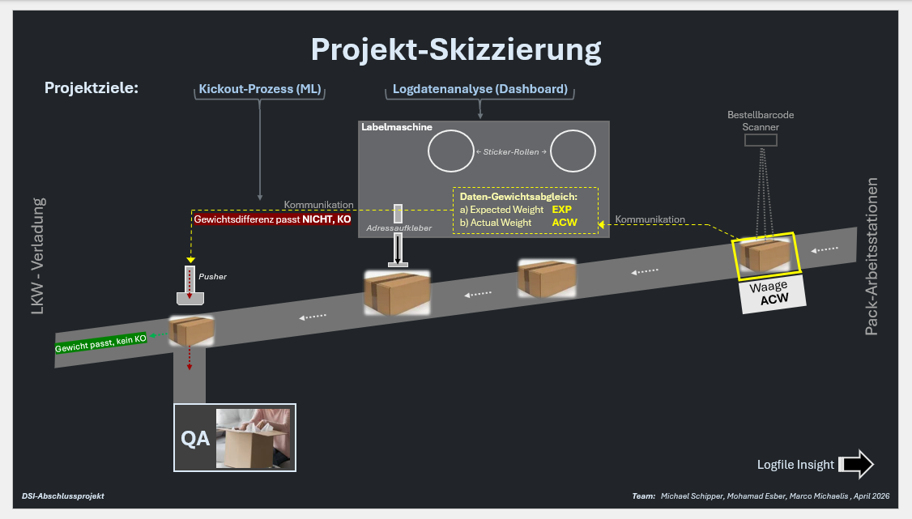

# Project 'Machinelog-Navigator'
DSI Data Science Institute by Fabian Rappert,
 Project process by Mohamad, Marco und Michael (April 2026)  
 
### Project Idea: Optimization and Controlling in Logistics – Parcel Shipping Process 

1. **GOAL:**  
a web-based dashboard based on the log data of a parcel shipping label printer for the purpose of monitoring the packing line
  
2. **GOAL:**  
a machinelearning modell for the purpose of reducing package-kickouts for manually check of content, focusing on too many items in package or too less, and increasing of probability to detect those issues in packages (increase of QA-productivity and increase of customer experience by reducing package issues) 
  

<b>Access the Webpage-Portal *(Amazon EC2 Webservice)*:</b> 
 <b>NOTE:</b> No Risk! Accept the use of an insecure connection in the browser's warning message.

 Link: [MachineLogNavigator](http://54.225.90.74/) (for PW please contact ocram-handwerker@web.de)

<b>or use the following link instead:</b>
 Additional-Link: [MachineLogNavigator](https://dsimlnappio-dsi-finalproject.streamlit.app/data_mgmt)
  <b>or alternatively local:</b>
 1) download the folder 'webpage', 
 2) open a CMD for this folder, 
 3) start 'streamlit run mainpage.py'

   
April 2026 .
