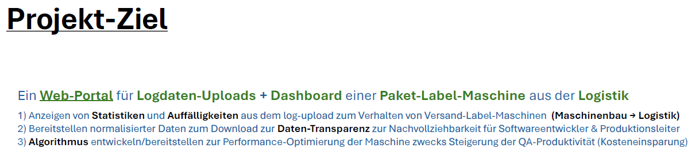

# Project 'Machinelog-Navigator'
## DSI Data Science Institute by Fabian Rappert
Project process by Mohamad, Marco und Michael (April 2026)  
  
## Project Idea: Optimization and Controlling in Logistics – Parcel Shipping Process 

1. **GOAL:**  
a web-based dashboard based on the log data of a parcel shipping label printer for the purpose of monitoring the packing line
  
2. **GOAL:**  
a machinelearning modell for the purpose of reducing package-kickouts for manually check of content, focusing on too many items in package or too less, and increasing of probability to detect those issues in packages (increase of QA-productivity and increase of customer experience by reducing package issues) 

April 2026
